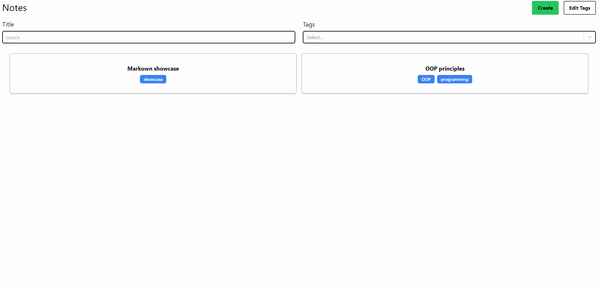
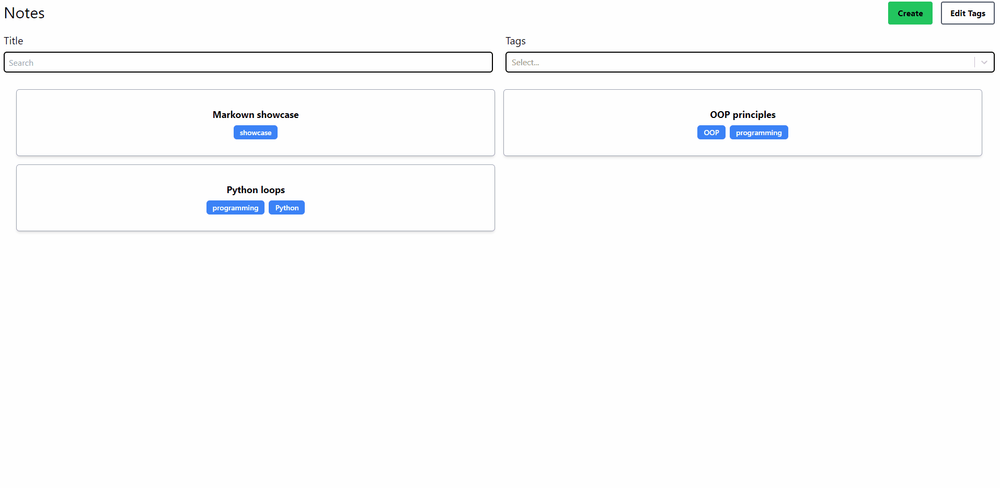
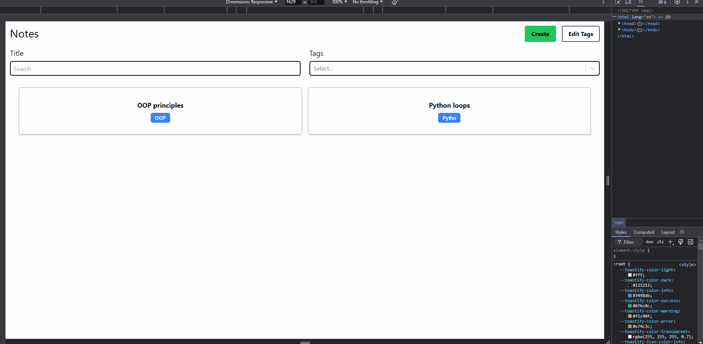

# React + TypeScript + Vite Note-Taking App

This is a **note-taking application** built with React, TypeScript, and Vite. The app supports **Markdown formatting**, the ability to add and edit tags, delete notes, and search through titles or tags. It's fully responsive and styled using Tailwind CSS. Building upon WebDevSimplified's project, I've incorporated extra features and cutting-edge technologies.

## Features

- Create, edit, and delete notes.
- Add and manage tags for better organization.
- Format notes using **Markdown** with live preview.
- Search through notes by title or tags.
- Fully responsive UI for seamless use on any device.
- Built with modern technologies: **TypeScript**, **Vite**, **React**, and **Tailwind CSS**.

---

## How to Run the Project

Follow these steps to set up and run the project locally:

```
git clone <repository-url>
cd <repository-directory>
npm install
npm run dev
```

---

## Preview








---

# React + TypeScript + Vite

This template provides a minimal setup to get React working in Vite with HMR and some ESLint rules.

Currently, two official plugins are available:

- [@vitejs/plugin-react](https://github.com/vitejs/vite-plugin-react/blob/main/packages/plugin-react/README.md) uses [Babel](https://babeljs.io/) for Fast Refresh
- [@vitejs/plugin-react-swc](https://github.com/vitejs/vite-plugin-react-swc) uses [SWC](https://swc.rs/) for Fast Refresh

## Expanding the ESLint configuration

If you are developing a production application, we recommend updating the configuration to enable type aware lint rules:

- Configure the top-level `parserOptions` property like this:

```js
export default tseslint.config({
  languageOptions: {
    // other options...
    parserOptions: {
      project: ['./tsconfig.node.json', './tsconfig.app.json'],
      tsconfigRootDir: import.meta.dirname,
    },
  },
})
```

- Replace `tseslint.configs.recommended` to `tseslint.configs.recommendedTypeChecked` or `tseslint.configs.strictTypeChecked`
- Optionally add `...tseslint.configs.stylisticTypeChecked`
- Install [eslint-plugin-react](https://github.com/jsx-eslint/eslint-plugin-react) and update the config:

```js
// eslint.config.js
import react from 'eslint-plugin-react'

export default tseslint.config({
  // Set the react version
  settings: { react: { version: '18.3' } },
  plugins: {
    // Add the react plugin
    react,
  },
  rules: {
    // other rules...
    // Enable its recommended rules
    ...react.configs.recommended.rules,
    ...react.configs['jsx-runtime'].rules,
  },
})
```
